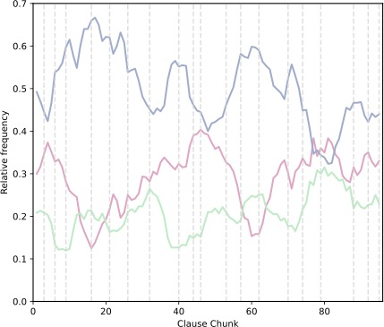

<div style="display: flex; justify-content: center; align-items: center; text-align: center;">
  <h1 style="flex: 1;">LANTERN<br>
  </h1>
</div>

<div>
<p align="center">
    <strong>
      A Language ANnotation Tool to undERstand Narratives
    </strong>
  </p>
</div>

<div align="center">
  

  <p align="center">
    <a href="#overview">Overview</a> •
    <a href="#how-to-use">How to Use</a> •
    <a href="#customize-lantern">Customize</a> 
  </p>
</div>


# Overview

This repository contains a pipeline for computational narrative analysis assisted by Large Language Models (LLMs).  

LANTERN can **preprocess**, **annotate**, and **analyse** entire collections of books, and understand what parts of a book expresses the following narrative information:
- ?style=flat&labelColor=rgb(171,235,198))  
  i.e., all that happens in the narrative world
- ?style=flat&labelColor=rgb(243,166,197))  
  i.e., all that happens within a character, such as memories, emotions, and perceptions.
- ?style=flat&labelColor=rgb(156,173,206))  
  i.e., additional details that contextualize the story, such as characters' relationships or sceneries.

E.g., ?style=flat&labelColor=rgb(171,235,198))?style=flat&labelColor=rgb(243,166,197))?style=flat&labelColor=rgb(156,173,206))  


# How to Use

Clone this repository and install the required dependencies.
  
    $ gh repo clone cltl/event-detection-tool
    $ pip3 install -r requirements.txt

Download [Meta-Llama-3-8B-Instruct-GGUF](https://huggingface.co/MaziyarPanahi/Meta-Llama-3-8B-Instruct-GGUF/resolve/main/Meta-Llama-3-8B-Instruct.Q4_K_M.gguf) and store it in `./llms/`.

<br>

**1. Preprocess** to split a book into paragraphs, sentences, and clauses.  

    python3 scripts/preprocess/preprocess_book.py --paragraphs --sentences --clauses 


**2. Annotate** each clause with one of three types of information, among <span style="background-color: rgb(171, 235, 198); color: black;"> events,</span><span style="background-color: rgb(243, 166, 197); color: black;">subjective experiences,</span> and <span style="background-color: rgb(156, 173, 206); color: black;"> contextual information.</span>

    python3 scripts/annotate/tag.py 

This step will produce `corpus.tsv` in the output folder, where each row corresponds to an annoteated clause.
If you prefer to annotate sentences, run

    python3 scripts/annotate/tag.py --sentences


**3. Analyse** stories, to observe their structure in terms of sequences of events subjective experiences, and contextual information.

    python3 scripts/annotate/tag.py --clauses

if you want to analyze how clauses have been annotated, or

    python3 scripts/annotate/tag.py --sentences

to do the same at the level of sentences.

This step visualizes 
- the distribution of <span style="background-color: rgb(171, 235, 198); color: black;"> events,</span><span style="background-color: rgb(243, 166, 197); color: black;">subjective experiences,</span> and <span style="background-color: rgb(156, 173, 206); color: black;"> contextual information</span> in the book,
- their frequency across chapters and book chunks,
- their entropy.

Here is an example of the frequency of the three labels in the book *Max Havelaar*, annotated at the clause level with with Openai gpt-4-1106-preview.


<div align="center">
  
</div>

 
<br>


# Customize LANTERN


Right now, LANTERN runs on *Max Havelaar* by Multatuli and *Nooit Meer Slapen* by Willem Frederik Hermans, and uses a [quantized version](https://huggingface.co/MaziyarPanahi/Meta-Llama-3-8B-Instruct-GGUF) of Llama-3 for clause splitting and annotation.
But you can apply this pipeline on different books (either in English or Dutch) and with other LLMs .

### Using Another Model...

...is possible, as long as it is supported by [llama-cpp](https://github.com/abetlen/llama-cpp-python).

Store your LLM in the folder `./llms/`, and specify its name in `config.ini`. 
In `config.ini`, you can also change system and user prompts.


### Using Another Book

1. Write book title and language in `config.ini`.  

2. Specify the url to the .txt of your book in `config.ini`, for instance  
[book]  
title = "Max Havelaar"  
path = "https://www.gutenberg.org/cache/epub/11024/pg11024.txt"

    If you already have a file containing your book, put it in `./inputs/`, and specify its location/name in `config.ini`. 
The file can either be:
    - a .txt file
    - a .tsv file where each row contains a paragraph, with the following columns

    | Column Name  | Description                                |
    | ------------ | ------------------------------------------ |
    | paragraph_id | Integer identifying a paragraph. |
    | chapter_id   | Integer indicating the unique identifier for each chapter.   |
    | paragraphs   | The actual text content of each paragraph.                   |
    | | |
  - a .tsv file where each row is a sentence in the book, with the following columns:

    | Column Name  | Description                                |
    | ------------ | ------------------------------------------ |
    |sentence_id	| Unique identifier for each sentence. |
    |paragraph_id	|Unique identifier for each paragraph.|
    |chapter_id	|Unique identifier for each chapter.|
    |sentences	|The actual text content of each sentence|
    | | |

3. You're ready to follow [these steps](#how-to-use).  
Note: if you already have the file containing paragraphs, you can preprocess the book running

  ```
  python3 scripts/preprocess/preprocess_book.py --sentences --clauses 
  ```

If you already have the sentences .tsv file, you can just run
```
python3 scripts/preprocess/preprocess_book.py --clauses 
```


Here's a corpus created with this methodology

Tool come risultato di partnership con consortium CLARIAH NL

Ecco come citare la metodologia usata in questo paper.


# Related Resources

This tool was created in collaboration with the [CLARIAH](https://www.clariah.nl) consortium. 

Check out the corpus [CLAUSE-ATLAS](https://huggingface.co/datasets/troianea/CLAUSE-ATLAS]) that we constructed using the LANTERN pipeline, and corresponding analyses in [this publication](https://aclanthology.org/2024.lrec-main.292.pdf).


